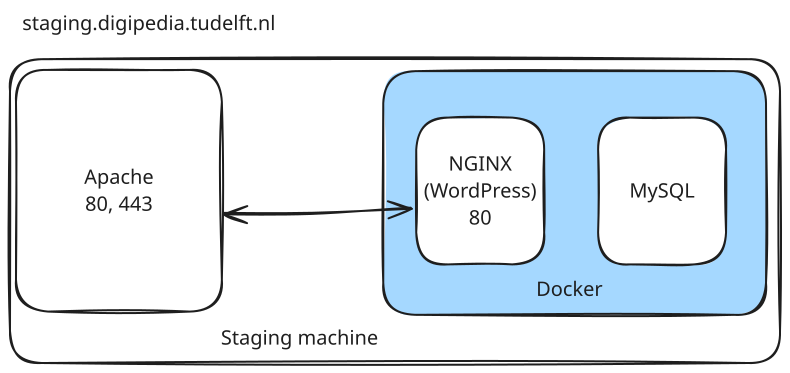

<p align="center">
  <a href="https://roots.io/bedrock/">
    
  </a>
</p>

<p align="center">
  <a href="https://packagist.org/packages/roots/bedrock">
    
  </a>

  <a href="https://packagist.org/packages/roots/wordpress">
    
  </a>
  
  

  <a href="https://github.com/roots/bedrock/actions/workflows/ci.yml">
    
  </a>

  <a href="https://twitter.com/rootswp">
    
  </a>
</p>

<p align="center">WordPress boilerplate with Composer, easier configuration, and an improved folder structure</p>

<p align="center">
  <a href="https://roots.io/bedrock/">Website</a> &nbsp;&nbsp; <a href="https://roots.io/bedrock/docs/installation/">Documentation</a> &nbsp;&nbsp; <a href="https://github.com/roots/bedrock/releases">Releases</a> &nbsp;&nbsp; <a href="https://discourse.roots.io/">Community</a>
</p>

## Sponsors

Bedrock is an open source project and completely free to use. If you've benefited from our projects and would like to support our future endeavors, please consider [sponsoring Roots](https://github.com/sponsors/roots).

<div align="center">
<a href="https://k-m.com/"></a> <a href="https://carrot.com/"></a> <a href="https://wordpress.com/"></a> <a href="https://worksitesafety.ca/careers/"></a> <a href="https://www.freave.com/"></a>
</div>

## Overview

Bedrock is a WordPress boilerplate for developers that want to manage their projects with Git and Composer. Much of the philosophy behind Bedrock is inspired by the [Twelve-Factor App](http://12factor.net/) methodology, including the [WordPress specific version](https://roots.io/twelve-factor-wordpress/).

- Better folder structure
- Dependency management with [Composer](https://getcomposer.org)
- Easy WordPress configuration with environment specific files
- Environment variables with [Dotenv](https://github.com/vlucas/phpdotenv)
- Autoloader for mu-plugins (use regular plugins as mu-plugins)
- Enhanced security (separated web root and secure passwords with [wp-password-bcrypt](https://github.com/roots/wp-password-bcrypt))

## Getting Started

See the [Bedrock installation documentation](https://roots.io/bedrock/docs/installation/).

## Stay Connected

- Join us on Discord by [sponsoring us on GitHub](https://github.com/sponsors/roots)
- Participate on [Roots Discourse](https://discourse.roots.io/)
- Follow [@rootswp on Twitter](https://twitter.com/rootswp)
- Read the [Roots Blog](https://roots.io/blog/)
- Subscribe to the [Roots Newsletter](https://roots.io/newsletter/)

## Current Architecture

The stack is composed as follows:


- Apache handles inbound traffic, acting as a reverse proxy
  - HTTP requests are forwarded to 443
  - HTTPS request are TLS terminated and forwarded to NGINX
  - certificates are locally installed
- NGINX listens on its internal 80 port, managing the WordPress instance
- The MySQL instance is in support of WordPress, not exposed to the host machine.

### Configuration

- Apache is consuming the `/etc/apache2/sites-available/reverse-proxy.conf` file.
- NGINX configuration is under `./docker/nginx/default.conf`
- MySQL usually restores a dump when intialized, then needs its env file to setup credentials.

See also the `compose.yml` file for a more detailed view.

## Docker 

### Image
Be sure to have cloned the plugin repo in the `web/app/plugins/tudelft-tutorial-platform-plugin` folder.

The image can be built with the following command:

```
docker build . \ 
  --secret id=composer_secret,src=auth.json \
  -t tudelft/tutorial-platform-wordpress:latest
```

where `auth.json` holds your Composer credentials.

As you can see in the Dockerfile, there's a multistage build that compose the whole:
- a base `composer` image to fetch PHP depencencies
- a base `node` image to build the theme
- finally, a PHP + NGINX image assemble the final image. NGINX and PHP fpm are executed as separate processes, managed by `Supervisord`.

> Note: The current build is designed to be independent, allowing for scalable deployments. You can still remove NGINX, delegating it to a separate container.

### Compose stack
Root folder holds a `compose.yml` file that aims to provide a local setup. You need some resources before starting it:

1. a dump for MySQL, to be placed in `./sql/local.sql`
2. an `.env` file with all necessary variables filled. You can find a template in `.env.example`.
3. (optional) you might have to restore a backup of the `wp-content` folder if you want to be able to see the loaded images, otherwise you'll get some empty spaces.

Then, you can start the whole stack with `docker compose up` and visit the platform on http://localhost:8000.

You'll get:
- a container with the custom WP instance
- a MySql instance
- an Adminer instance, useful to browse the DB content.


## Machine setup and deploy

To set up a new machine or a new environment, you need to:
1. setup the machine
2. install the GH runner
3. prepare the environment for the application

### Setting up the machine
In this step we'll install Docker and Apache2.

**Requirements**:
- SSL cert and key

#### 1. Install Docker
1. install Docker as stated on the official guide
2. add the current user to the `docker` group with `usermod -aG $USER docker`, you might need to logout and login
3. verify that `docker run hello-world` work without sudo

#### 2. Install Apache
1. install the following packages `apache2`, `apache2.2-common`
2. enable the required modules: `sudo a2enmod proxy proxy_http proxy_balancer lbmethod_byrequests ssl rewrite headers`
3. write the config file `/etc/apache2/sites-available/reverse-proxy.conf`, using the template provided in `./apache/reverse-proxy.conf`. Remember to fix the placeholders with your values.
4. enable and start apache with `sudo systemctl enable apache2` and `sudo systemctl start apache2`
5. check the service status with `sudo systemctl status apache2` to spot any errors
6. enable the site with `sudo a2ensite reverse-proxy.conf`

#### 3. Install the GitHub runner
1. To add a new self-hosted GitHub runner open the **Settings** page of the repository and follow the instructions available on (Sidebar) Actions > Runners > "New self-hosted runner".
  - after launching `./run.sh` and verified that everything is ok, kill the process with CTRL+C.
  - install the runner as a service executing `./svc.sh install $USER`, then start it with `./svc.sh start`
  - if everything went ok you should see the new runner in the repo settings.
  - add a tag to identify the runner. This tag will be used by the deployment action to pick the right machine.
2. if needed, head over the **Environment** section (sidebar) and create a new environment.
  - in the page, be sure to have set:
    - `REPO_ASSET_PATH`: (secret) path to the `platform-wordpress` folder. (e.g. `/home/user/platform-wordpress`)
    - `CONTAINER_NAME`: `platform` 

#### 4. Project folder
1. on the machine, create a new folder `platform-wordpress` and put there:
  - the `compose.yml` file
  - the `.env` file
  - a `plugin.env` file
2. under the `platform-wordpress` you also need to:
  - create a `sql` folder, and copy the init scripts for MariaDB
  - create a `wp-content` folder, and copy the uploads

This is an example of the folder structure
```
.
├── docker-compose.yml
├── .env
├── plugin-env
├── sql
│   ├── local.sql
└── wp-content
    ├── 2024
    ├── 2025
    └── uploads
```

Once you have filled envs with secrets and the runner is active, the machine is ready to receive deploy notifications.

You may then define a new runner, if needed. Use the ones defined under `.github/workflows/` to get an idea.
